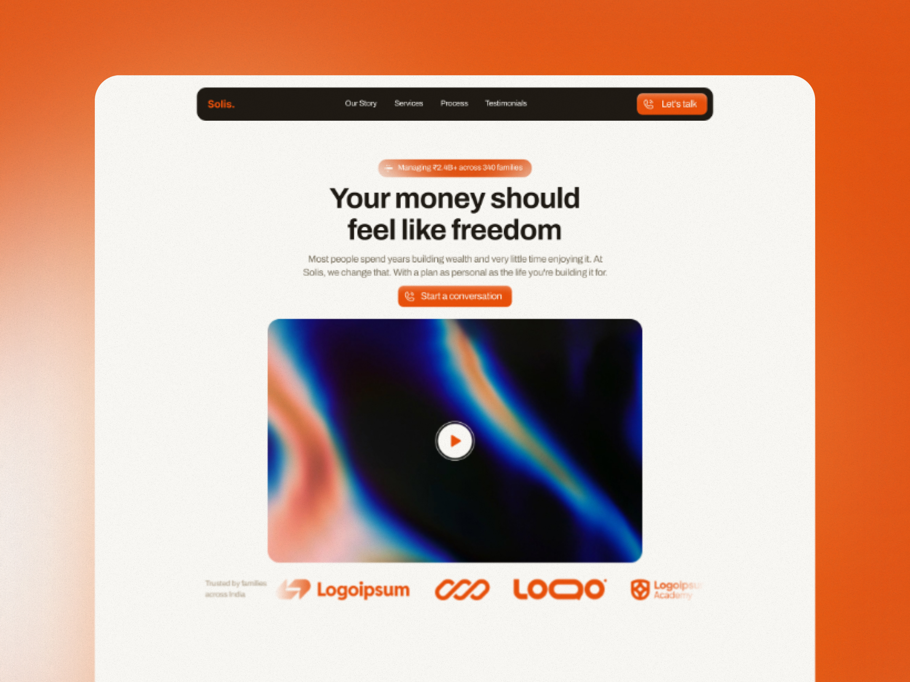

# Solis

> Full brand identity, copywriting, UI design & Framer build for a private wealth management firm.
> A finance site that actually feels human - warm, personal, and built to earn trust before anyone books a call.

---

## Live Site

[Solis - Live Site](https://solis.framer.website)

---

## Links

[Upwork Project](https://www.upwork.com/freelancers/~014b89a959de140af2?p=2067614929284898816)

[Upwork Profile](https://www.upwork.com/freelancers/~014b89a959de140af2?mp_source=share)

[Full Case Study](./CASE-STUDY.md)

---

## Brand System

| Role | Token | Hex |
|------|-------|-----|
| Background | Off White | `#FAF8F4` |
| Background Tint | Off White - 20% | `#FAF8F4` at 10% |
| Card / Surface | Container White | `#FAF6E8` |
| Text / Dark BG | Off Black | `#1E1A14` |
| Dark BG Tint | Off Black - 20% | `#1E1A14` at 20% |
| Body Text | Taupe | `#7A7260` |
| Secondary Text | Light Taupe | `#A89880` |
| Primary / Accent | Orange | `#E8500A` |

**Typography:**

| Role | Font |
|------|------|
| H1 | `Archivo` Bold - 48px / 1.1 - tight, authoritative, stops the scroll |
| H2 | `Archivo` Bold - 40px / 1.4 - section anchors, warm and confident |
| H3 | `Archivo` Bold - 33px / 1.4 - card titles and sub-section headings |
| H4 | `Archivo` Bold - 28px / 1.4 - feature titles |
| H5 | `Archivo` Bold - 23px / 1.4 - smaller feature headings |
| H6 | `Archivo` Bold - 19px / 1.4 - labels and overlines |
| Body (B) | `Archivo` Regular - 16px / 1.4 - readable, warm, never sterile |
| Body Small | `Archivo` Regular - 13px / 1.4 - secondary body and captions |
| Body Small Bold | `Archivo` Semibold - 13px / 1.4 - Orange - accent labels |
| Button | `Archivo` Regular - 16px / 1.2 - Off White - CTA text |

**Icons:** Phosphor Icons - Duotone weight throughout.

---

## What Was Built

```
Desktop
├── Navigation (floating pill nav - sticky)
├── Main
│   ├── Hero (center-aligned - headline + video + trust strip)
│   ├── Philosophy / About (split layout - headline left + 3-slide carousel right)
│   ├── Features Bento Grid (bento grid - dark BG - custom UI cards)
│   ├── Services Accordion (accordion left + image right - 6 services)
│   ├── Process (split layout - headline left + 4 numbered steps right)
│   ├── Testimonials (editorial mixed layout - portraits + pull quotes)
│   ├── Pricing (2 card layout - Essential + Private - toggle)
│   ├── FAQ (split layout - headline left + 6 accordion questions right)
│   ├── CTA (full width - dark BG - center aligned)
│   └── Footer (4 column grid - dark BG)
Tablet
Phone
```

---

## Built With

- Framer
- Phosphor Icons (Duotone)
- Google Fonts (Archivo)

---


*Designed & built by Himanshu Dhara - Framer Developer & Brand Designer - 2026*
